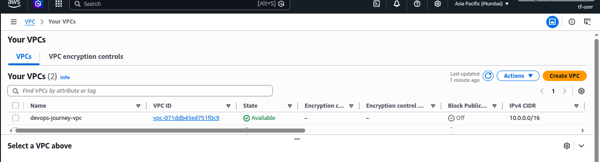
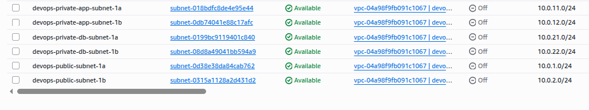
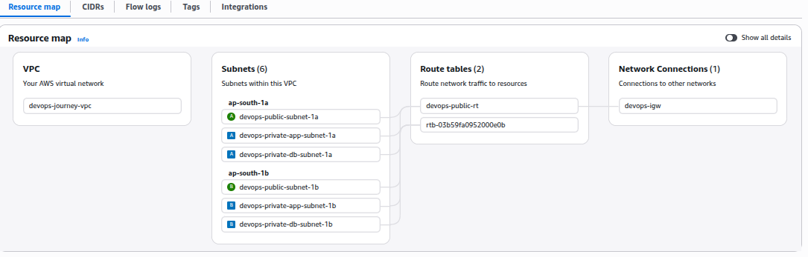

# Production-Grade Laravel Deployment on AWS with Terraform

[](https://www.terraform.io/)
[](https://aws.amazon.com/)
[](https://laravel.com/)


> Enterprise-level AWS infrastructure deployment using Terraform, implementing best practices for high availability, security, and scalability.

## 🎯 Project Overview

Deploying a production-ready Laravel application on AWS using 100% Infrastructure as Code (Terraform). This project demonstrates professional DevOps practices and AWS Well-Architected Framework principles.

**Status:** 🚧 Week 1 - In Progress  
**Started:** June 26, 2026  
**Target Completion:** July 23, 2026

---

## 🏗️ Architecture

                                Internet
                                   ↓
                               Route53
                                   ↓
                          [ACM Certificate]
                                   ↓
                Application Load Balancer (Public)
                      ↓                ↓
              ┌───────────────────────────────┐
              │   Auto Scaling Group          │
              │  ┌──────────┐  ┌──────────┐  │
              │  │ EC2 (AZ1)│  │ EC2 (AZ2)│  │
              │  │  Laravel │  │  Laravel │  │
              │  └──────────┘  └──────────┘  │
              │  (Private Subnets)            │
              └───────────────────────────────┘
                          ↓
                RDS MariaDB (Multi-AZ)
                  (Private Subnets)


## ✨ Features

### Completed ✅
- [x] Custom VPC with CIDR 10.0.0.0/16
- [x] 6 Subnets (2 public, 4 private) across 2 Availability Zones
- [x] Internet Gateway for public connectivity
- [x] Public route tables with IGW routing
- [x] Complete network isolation architecture
- [x] Security Groups (ALB, EC2, RDS) with defense-in-depth architecture
- [x] Three-tier security architecture (Public → App → Database)
- [x] RDS MariaDB Multi-AZ deployment

### In Progress 🚧
- [ ] Application Load Balancer with SSL
- [ ] Auto Scaling Group (2-6 instances)
- [ ] Laravel application deployment

### Planned 📋
- [ ] Route53 DNS configuration
- [ ] ACM SSL/TLS certificates
- [ ] AWS Secrets Manager integration
- [ ] CloudWatch monitoring and alarms
- [ ] Automated backups
- [ ] CI/CD pipeline

---

## 🔧 Technologies

| Category | Technology |
|----------|-----------|
| **Infrastructure as Code** | Terraform 1.x |
| **Cloud Provider** | AWS (VPC, EC2, RDS, ALB, Route53, ACM, Secrets Manager, CloudWatch) |
| **Application Framework** | Laravel (PHP) |
| **Database** | MariaDB (RDS Multi-AZ) |
| **Monitoring** | CloudWatch |
| **Version Control** | Git, GitHub |

---

## 📦 Infrastructure Components

### Network Architecture

| Component | Configuration | Purpose |
|-----------|--------------|---------|
| **VPC** | 10.0.0.0/16 | Isolated network environment |
| **Public Subnets** | 10.0.1.0/24, 10.0.2.0/24 | ALB and NAT Gateway |
| **Private App Subnets** | 10.0.11.0/24, 10.0.12.0/24 | EC2 application servers |
| **Private DB Subnets** | 10.0.21.0/24, 10.0.22.0/24 | RDS database |
| **Availability Zones** | 2 (Multi-AZ) | High availability |
| **Internet Gateway** | 1 | Public internet access |
| **NAT Gateway** | 1 (planned) | Private subnet outbound traffic |

---

## 🚀 Quick Start

### Prerequisites

```bash
# Required tools
- AWS Account with IAM permissions
- Terraform >= 1.0
- AWS CLI configured
- Git


# Clone repository
git clone https://github.com/YOUR-USERNAME/laravel-aws-terraform-production.git
cd laravel-aws-terraform-production/terraform

# Initialize Terraform
terraform init

# Review changes
terraform plan

# Apply infrastructure
terraform apply

# Destroy when done (save costs)
terraform destroy


VPC Created


Subnets Configuration


Networking Setup



🔒 Security
✅ Private subnets for application and database
✅ Security groups with least privilege
✅ No hardcoded credentials (Secrets Manager)
✅ Encryption at rest for RDS
✅ SSL/TLS for public endpoints
✅ IAM roles (no access keys on instances)


💰 Cost Estimation
Current (Week 1 - Testing):

VPC, Subnets, IGW: Free
Testing duration: 1 hour = ~$0.00
Full Production Stack:

EC2 (2 × t3.medium): ~$60/month
RDS (db.t3.micro): ~$15/month
ALB: ~$16/month
NAT Gateway: ~$32/month
Total: ~$123/month
All test infrastructure is destroyed after each session to minimize costs.


📊 Project Progress
 Week 1: VPC and Networking (60% complete)
 Week 2: Compute and Database
 Week 3: Load Balancing and Application
 Week 4: Security, Monitoring, and Documentation


📚 Learning Outcomes
Infrastructure as Code (Terraform)
AWS VPC networking and subnetting
Multi-AZ architecture design
CIDR notation and IP planning
Security best practices
Cost optimization strategies
Git version control
Technical documentation


👨‍💻 Author
Subha Sankar Das
DevOps Engineer | AWS & Azure Certified | 9+ Years IT Experience

LinkedIn: https://www.linkedin.com/in/subha-sankar-das-9600ba105/
Email: dassubha77@gmail.com

📄 License
This project is for educational and portfolio purposes.

⭐ Star this repository if you find it helpful!

Last Updated: June 28, 2026